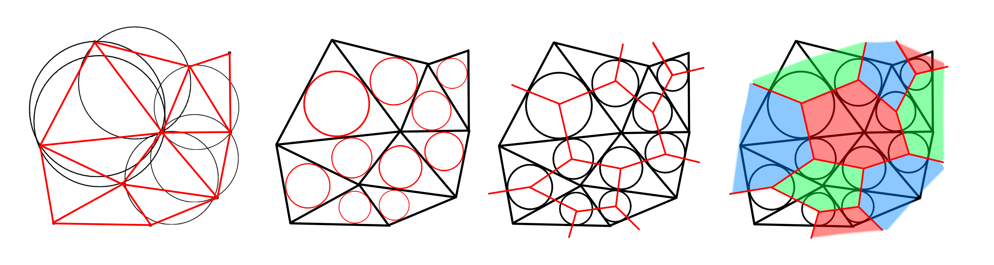
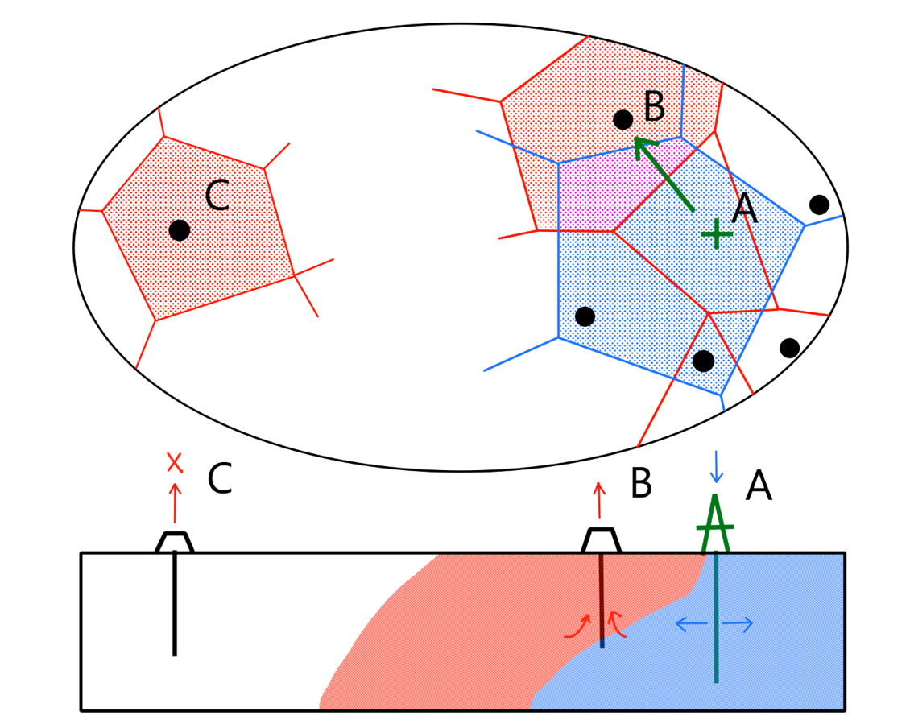
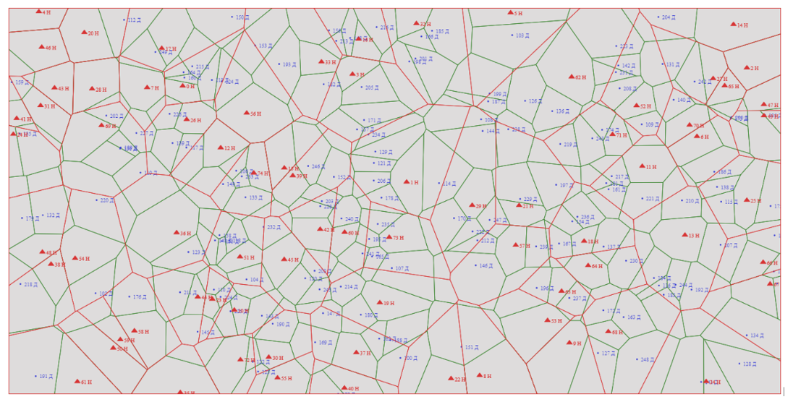

  

<h1 align="center">
  Oil wells map creator
</h1>

## Overview
Academic project for creating oil wells interaction map.
Map construction is based on the application of Voronoy areas method
Injection and production wells are connected to each other in case if theirs areas intersects

### Voronoy method scheme:

### The scheme of wells interaction:

### Result map of wells intercation:

## Release Notes
Can be found in [RELEASE_NOTES](RELEASE_NOTES.md).

## Authors
* Egor Yakimov - [eyakimov](https://github.com/RyanReyMorris)

## Code of Conduct
Please, follow [Code of Conduct](CODE_OF_CONDUCT.md) page.

## Contributing
Please, follow [Contributing](CONTRIBUTING.md) page.

## License
This project is Apache License 2.0 - see the [LICENSE](LICENSE) file for details
